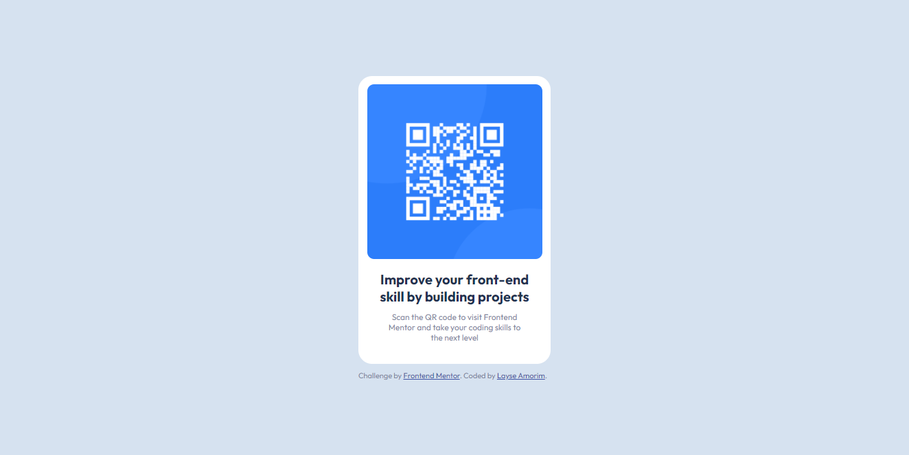

# Frontend Mentor - QR code component solution

This is a solution to the [QR code component challenge on Frontend Mentor](https://www.frontendmentor.io/challenges/qr-code-component-iux_sIO_H). Frontend Mentor challenges help you improve your coding skills by building realistic projects. 

### Screenshot

### Links

- Solution URL: [https://github.com/layse-dev/qr-code-component-main.git](https://github.com/layse-dev/qr-code-component-main.git)

## My process

### Built with

- Semantic HTML5 markup
- CSS custom properties
- Flexbox

## Author
 
- Frontend Mentor - [@layse-dev](https://www.frontendmentor.io/profile/layse-dev)
